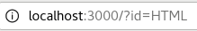

# **10-URL을 통해서 입력된 값 사용하기**



이 주소에서 `id=HTML`은 query string이다.<br>
그리고 `/?id=HTML`까지가 url 변수이다.
```
...
    var url = request.url;
    console.log(url)
...
```
이 코드를 돌려보면 에러가 나지만 아래와 같은 출력이 나온다.
```
/?id=HTML
```
따라서 url 변수의 값이 `/?id=HTML`이라는 걸 알 수 있었다.

<br>

우리는 `url` 변수 안에 들어있는 값을 추출하는걸 통해 우리가 원하는 값을 얻을 수 있다.<br>
이걸 위해서는 우리는 url로부터 url을 분석해서 데이터를 추출해야 한다.

<br>

---

<br>

`require()`: 요구하다.<br>
`'http'`, `'fs'`, `'url'`을 요구한다.<br>

```
var http = require('http');
var fs = require('fs');
var url = require('url');     // 'url' 모듈을 url 변수를 통해 사용할 것이라는 코드
...
```
`require` 내부에 있는 `'http'`, `'fs'`, `'url'`은 모듈이라고 한다.<br>
**모듈**은 Node.js가 가지고 있는 수많은 기능들을 비슷한 애들끼리 그룹핑 해 놓은 것이다.<br>

<br>

```
var url = require('url');

var url = request.url;
=> var _url = request.url;
```
두 개의 변수가 이름이 같아져서 아래의 변수 이름을 바꿔준다.<br>

<br>

```
...
    var _url = request.url;
    var queryData = url.parse(_url, true).query;
    console.log(queryData);
...
```
`qeuryData` 변수를 추가하고 출력해보면 아래와 같은 결과가 나온다.
```
{id: 'HTML'}
```
이러한 형태로 나온다는 것은 `queryData` 변수에 담긴 값이 객체라는 뜻이다.<br>
*객체에 대해서는 지금은 몰라도 된다.*<br>

```
출력: console.log(queryData.id);
결과: HTML
```
뒤에 `.id`를 붙여서 다시 출력을 해보면 이런 결과가 나온다.

<br>


주소의 query string이 id로 되어 있기 때문에 HTML이 출력된 것이고,<br>
값의 이름을 name으로 바꾸고 같은 값이 나오게 하려면, `.id`를 `.name`으로 바꿔줘야 한다.
```
주소: localhost:3000/?name=HTML
출력: console.log(queryData.name);
결과: HTML
```

<br>

---

<br>

```
response.end(fs.readFileSync(__dirname + _url));
```
사용자가 접속한 url에 따라서 파일들을 읽어주는 코드가 `fs.readFileSync(__dirname + _url)` 부분이다.<br>
이 부분을 `queryData.id`를 넣고 실행해주면 화면과 콘솔에 id가 출력된다.


주소를 바꿔주면 바꿔준 query string의 id 값이 화면에 출력된다.
```
ex) localhost:3000/?id=CSS

CSS
```