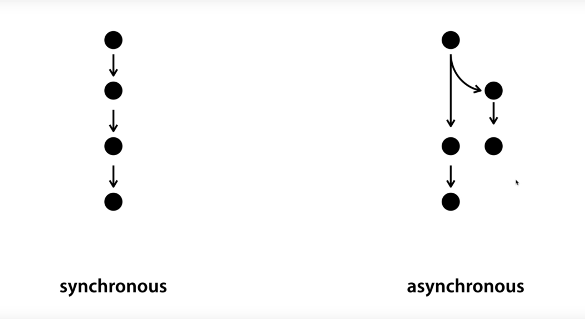

# 28-Nodejs에서 동기와 비동기

*출처: 생활코딩 유튜브: https://youtu.be/3eOGYLxropQ*

 

## synchronous 동기
일이 처리되면서 그 일이 오랫동안 처리되어야 하는 경우에'도' 기다렸다가 그 다음 일을 처리하는 것이 **동기적인 방식**으로 일을 처리하는 것이다.

 

## asynchronous 비동기
병렬적으로 동시에 여러 일을 처리하는 것이 **비동기적인 처리**이다. 
비동기적인 방식은 **효율적**이지만, **복잡하다**. 

Node.js는 비동기적 처리를 하기 위한 좋은 기능들을 가지고 있다. 