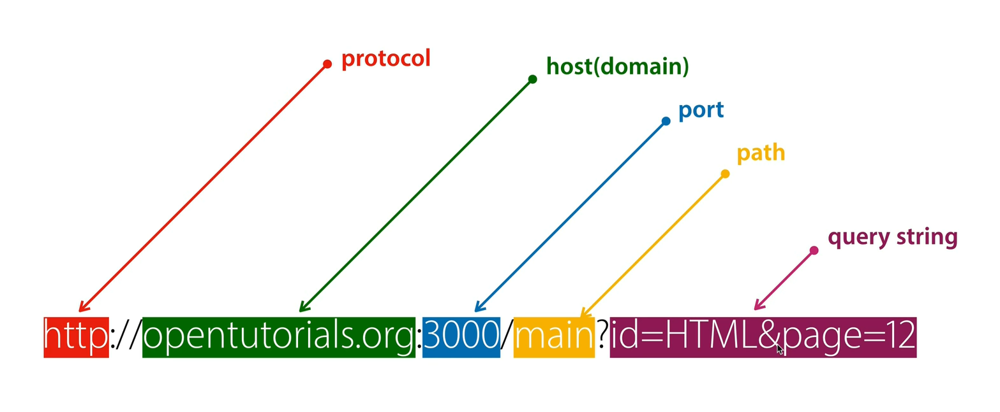

# **09 URL의 이해**

*출처: 생활코딩 유튜브: https://youtu.be/Zhbvui_T9VY*

<br>

## **protocol**
HTTP: Hyper Text Transfer Protocol <br>
웹브라우저와 웹서버가 서로 데이터를 주고받기 위해서 만든 통신 규칙 <br>

<br>

## **host(domain)**
호스트<br>
인터넷에 접속되어 있는 각각의 컴퓨터를 말한다.<br>
opentutorials.org는 특정한 인터넷에 연결되어 있는 컴퓨터를 가리키는 주소

<br>

## **port**
포트 번호<br>

한 대의 컴퓨터 안에 여러 대의 서버가 있을 수 있다. <br>
그러면 클라이언트가 접속했을 때 그 중 어떤 서버와 통신할지가 애매하다. <br>
그래서 접속할 때 3000이라고 하면, 3000번 포트에 연결된 서버와 통신하게 되는 것이다.<br>
```
// main.js
app.listen(3000)

// 웹 주소
localhost:3000
```
<br>

웹 서버는 전 세계적으로 80번 포트를 쓴다고 약속되어 있다.<br>
따라서 포트 번호를 생략하면 80번 포트에 접속된다.

<br>

## **path**
컴퓨터 안에 있는 어떤 디렉토리의 어떤 파일인지를 가리킨다.

<br>

## **query string**
query string의 값을 변경하면 웹서버에게 데이터를 전달할 수 있다.<br>
ex) 내가 읽고 싶은 정보는 html이고, 12페이지이다. <br>

query string의 구조
1. query string은 ?(물음표)로 시작됨.
2. 값과 값은 &으로 구분함.
3. 값의 이름과 값은 =로 구분함
